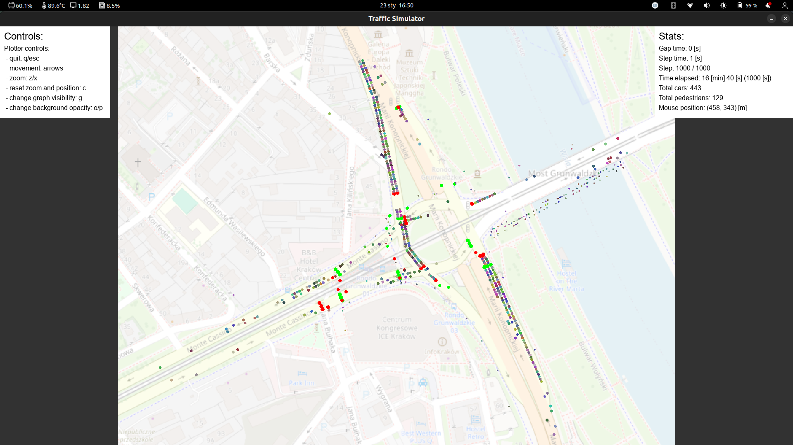
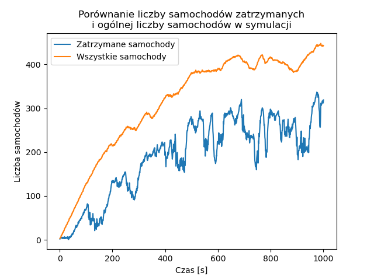

# PROJEKT: SYMULACJA RUCHU DROGOWEGO NA PRZYKŁADZIE RONDA GRUNWALDZKIEGO W KRAKOWIE

## About

### Description

This project was created for the course *Symulacja Systemów Dyskretnych* (Discrete Systems Simulation) 
at AGH University of Science and Technology in Kraków, Poland.

### Autorzy projektu

- [Łukasz Łabuz](https://github.com/luklabuz)
- [Dawid Małecki](https://github.com/coado)
- [Mateusz Mazur](https://github.com/mzsuetam)

## Abstract 

The purpose of this project was to design and implement 
a simulation of pedestrian and vehicular traffic at 
the Rondo Grunwaldzkie in Kraków, Poland. 
The obtained results were analysed
and found to satisfactorily reflect the real situation.
The study attempts to answer the question,
what the causes of frequent traffic jams at this transport hub are. 
It was found that they arise due to faulty traffic organisation at the roundabout. 

## Overview

The file src/main.py contains the main program 
and the quick description of the simulation process.

The _Simulator_ class is responsible for the simulation process.
It stores the state of the simulation and provides methods
for its modification and analysis.

It can be configured using the JSON file with the model of the simulated area.
In our case, it is the Rondo Grunwaldzkie in Kraków, Poland (see the file [assets/model.json](./assets/model.json)).

The _Plotter_ class is responsible for the visualisation of the simulation.

## Use case 

The simulation can be used for the analysis of the traffic flow.
It can be used to test the impact of changes in the traffic organisation
on the traffic flow, or to rate the existing traffic organisation.

For example, we attempt to answer the question,
what the causes of frequent traffic jams at this transport hub are.
Thus, we can analyse how many cars are stopped at the roundabout.

Example dataframe with the output of the simulation (for all the cars) 
can be found in the file [results/cars-stopped.csv](./results/cars-stopped.csv).
