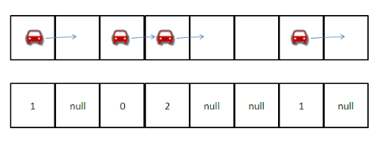
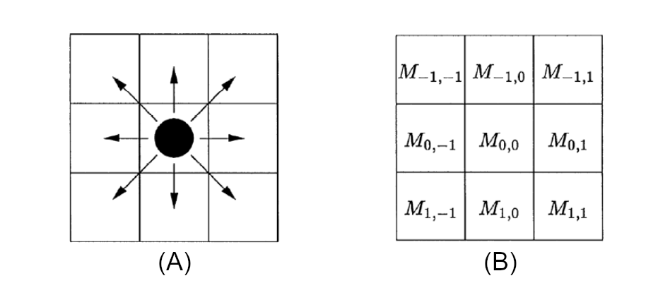

# Główne źródła

## Paweł Gora *Adaptacyjne planowanie ruchu drogowego*

[@Gora2010]

### Abstrakt

W pracy przedstawione zostały metody adaptacyjnego planowania ruchu drogowego oparte na algorytmie genetycznym. Ich skuteczność przetestowana została przy użyciu **symulatora ruchu drogowego TSF** (Traffic Simulation Framework). Opisana została również architektura samego symulatora oraz techniczne aspekty jego implementacji przy u˙zyciu technologii .NET Framework

### Wykorzystanie - Pojazdy w symulacji ruchu drogowego

**Cel:** Przejazd z punktu A do punktu B znajdujących się na krawędziach obszaru symulacji.

**Forma symulacji:** Podejście agent-based. Każda jednostka będzie rozróżniana, każdy kierowca będzie rozróżnialny.

Odcinki dróg mogą mieć kilka pasów ruchu. Każdy z pasów ruchu jest reprezentowany jako skończona taśma podzielona na komórki, które będą wchodziły w skład automatu komórkowego. W każdej chwili ewolucji modelu pojedyncza komórka może być pusta lub zajeta przez
1 pojazd. Ewolucja odbywa się w dyskretnym czasie zgodnie z ustalonymi regułami ruchu.

### Wykorzystanie - Model infrastruktury drogowej

- skrzyżowania
- rozróżnialność typów dróg
- światła drogowe
- wielopasmowość dróg
- przejścia dla pieszych

## Amir Rasouli *Pedestrian Simulation: A Review*

[@RasouliND]

### Abstrakt

Artykuł ten skupia się na różnych aspektach modelu ruchu pieszego (tłumu) –
i symulacji. Przegląd obejmuje: różne kryteria modelowania, m.in jak szczegółowość, techniki i czynniki zaangażowane w modelowanie zachowań pieszych zachowanie i różne metody symulacji pieszych z bardziej szczegółowymi wynikami przyjrzyjmy się dwóm sposobom symulowania zachowań pieszych w scenach ruchu drogowego. Na koniec przedstawiono zalety i wady różnych technik symulacyjnych omówiono i sformułowano zalecenia dotyczące przyszłych badań.

### Wykorzystanie - Piesi w symulacji ruchu drogowego

**Cel:** Przejazd z punktu A do punktu B znajdujących się na krawędziach obszaru symulacji.

**Forma symulacji:** Podejście entity-based. Każda jednostka nie będzie rozróżniana, każda będzie miała te same zdefiniowane prawa i statystyki.

Zgodnie z modelem komórkowym, każda jednostka zajmować będzie dokładnie jedną przestrzeń na siatce. Decyzja o zmianie położenia na sąsiadujące komórki będzie podejmowana z określonym prawdopodobieństwem.

Przyjmujemy, że piesi mogą przekraczać ulice tylko w miejscach oznaczonych jako przejścia dla pieszych, zgodnie z następującymi zasadami:

- Jednostki kierują się w kierunku przejścia, jeśli ich celem jest przejście na drugą stronę ulicy.
- Niedopuszczalne jest wychodzenie poza granice przejścia.
- Ruch innych pieszych wpływa na trasę poruszania się jednostek.

# Źródła pomocnicze

[@NagelSchreckenberg1992] - wprowadzenie teoretyczne do modelu Nagela-Schreckenberga, podstawy naszego systemu dynamicznego ruchu drogowego
<!-- https://sci-hub.se/10.1051/jp1:1992277 -->

[@Altmann] - praktyczne wskazówki do implementacji systemów dynamicznych
<!-- https://users.cs.northwestern.edu/~agupta/_projects/networking/QueueSimulation/mm1.html -->
 
[@Wiering2004] - przekrój metod symulacji ruchu drogowego z uwzględnieniem świateł ulicznych
<!-- https://dspace.library.uu.nl/bitstream/handle/1874/20840/wiering_04_simulation.pdf?sequence=2 -->

[@Kotusevski2009] – przekrój rozwiązań zaimplementowanych w praktycznych symulatorach ruchu drogowego
<!-- https://mro.massey.ac.nz/bitstream/handle/10179/4506/TrafficSimulatorReview_arlims.pdf?sequence=1&isAllowed=y -->

 [@Cimr2000] – wprowadzenie do symulacji ruchu drogowego opartej na automatach komórkowych
<!-- http://delibra.bg.polsl.pl/Content/49959/BCPS-54366_2000_Modelowanie-stanow-d.pdf -->

# Bibliografia
