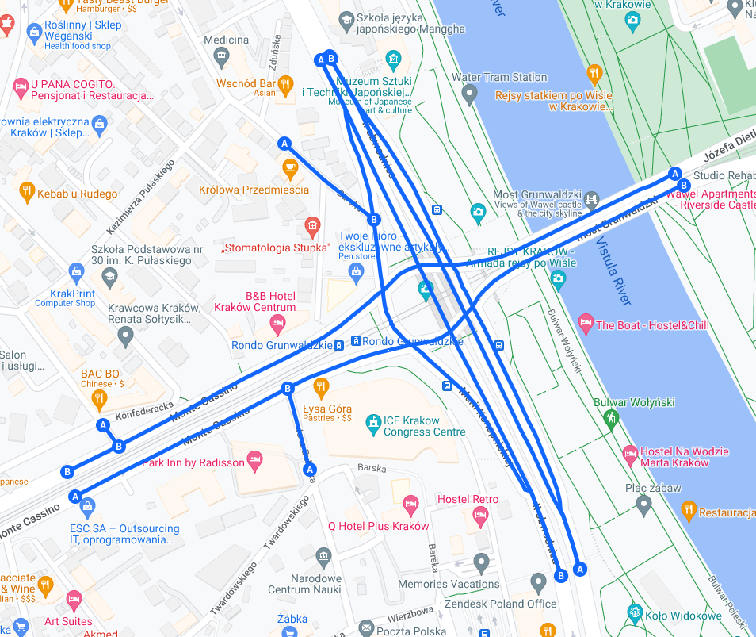
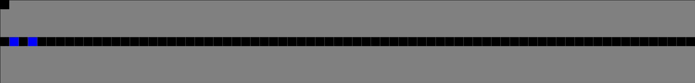
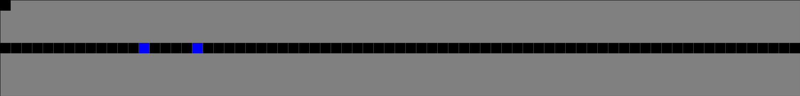
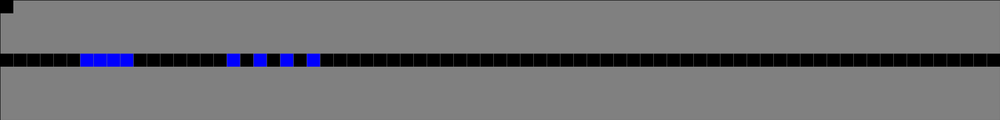

# Postępy prac

## Prace wykonane na rzecz projektu w okresie od ostatniego spotkania

Pierwsze dwa tygodnie pracy:

1. Wyszukanie dodatkowych tekstów pomocniczych
2. Wstępne zapoznanie się z biblioteką
3. Zagłębienie się w główne źródła
4. Stworzenie **kwerendy literaturowej**
   
Drugie dwa tygodnie pracy:

1. Poprawa formatu dokumentu z kwerendą \
 ($Pandoc + \text{\LaTeX{}} + CiteProc$)
2. Rozpoczęcie prac nad modelem formalnym
3. Dalsza nauka korzystania z biblioteki
  
## Zestawienie osób i wykonanych przez nie zadań

### Pierwsze dwa tygodnie

+---------------------------------------+-----------+-----------+-----------+
| Zadanie                               | Łukasz \  | Dawid \   | Mateusz \ |
|                                       | Łabuz     | Małecki   | Mazur     |
+:======================================+:=========:+:=========:+:=========:+
| Wyszukanie dodatkowych tekstów        |\checkmark |           |           |
| pomocniczych                          |           |           |           |
+---------------------------------------+-----------+-----------+-----------+
| Wstępne zapoznanie się z biblioteką   |           |           |\checkmark |
+---------------------------------------+-----------+-----------+-----------+
| Zagłębienie się w główne źródła       |           |\checkmark |\checkmark |
+---------------------------------------+-----------+-----------+-----------+
| Stworzenie **kwerendy literaturowej** |\checkmark |\checkmark |\checkmark |
+---------------------------------------+-----------+-----------+-----------+

--- 

### Drugie dwa tygodnie

+---------------------------------------+-----------+-----------+-----------+
| Zadanie                               | Łukasz \  | Dawid \   | Mateusz \ |
|                                       | Łabuz     | Małecki   | Mazur     |
+:======================================+:=========:+:=========:+:=========:+
| Poprawa formatu dokumentu z kwerendą  |           |           |\checkmark |
+---------------------------------------+-----------+-----------+-----------+
| Rozpoczęcie prac nad modelem formalnym|\checkmark |\checkmark |           |  
+---------------------------------------+-----------+-----------+-----------+
| Dalsza nauka korzystania z biblioteki |           |           |\checkmark |
+---------------------------------------+-----------+-----------+-----------+

# Rozpoczęcie prac nad modelem formalnym

## Przypomnienie celu projektu

Celem projektu jest stworzenie modelu symulacyjnego ruchu drogowego na rondzie Grunwaldzkim w krakowie.

{height=60%}

## Materiały źródłowe

Kwerenda literaturowa naszego projektu została podzielona na dwie sekcje - główną oraz pomocniczą.

Materiały z sekcji głównej będą stanowiły podstawę do stworzenia modelu formalnego,
natomiast materiały z sekcji pomocniczej będą stanowiły dodatkowe źródła informacji,
które mogą okazać się przydatne w trakcie tworzenia modelu formalnego i implementacji.   

### Główne materiały źródłowe

- Gora P. *Adaptacyjne planowanie ruchu drogowego* [@gora2010adaptacyjne]
- Rasouli A. *Pedestrian Simulation: A Review* [@rasouli2021pedestrian]

## Skale oraz technika symulacji

W materiale [@rasouli2021pedestrian] przedstawione zostały definicje różnych skal oraz technik symulacji.

W naszym projekcie wykorzystujemy następujące:

### Techniki symulacji

**Model komórkowy** - model polegający na dyskretyzacji obszarów, na których poruszają się symulowane jednostki. Według założenia, każda z nich może zajmować jedną komórkę na siatce w danym momencie. W każdym kroku symulacji, jednostki mogą zmienić swoją pozycję na sąsiednią komórkę.

---

### Skale symulacji

**Agent-Based** - skala, w której każda jednostka jest rozróżnialna, ma własne, zdefiniowane statystyki oraz zbiór możliwych do podjęcia decyzji. Na jej zachowanie ma wpływ otoczenie, infrastruktura czy też inne jednostki.

**Entity-Based** - skala, w której jednostki są z założenia nierozróżnialne. Nie wyróżniają się niczym. Zachowują się według ściśle ustalonych reguł. Nie mają wpływu na otoczenie. 

## Elementy modelu formalnego

### Automat komórkowy

Rozpoczęcie formalizacji naszego modelu zaczynamy od definicji automatu komórkowego przedstawionej w [@gora2010adaptacyjne] - rysunek \ref{img_gora_2009_def_aut_kom}.

---

![Definicja Automatu komórkowego przedstawiona w [@gora2010adaptacyjne] \label{img_gora_2009_def_aut_kom}](img/gora-2010-definicja-automatu-komorkowego.png)

---

### Jednostki

Następnie rozważamy algorytmy zachowania jednostek, które wchodzą w skład naszego modelu.
W naszym przypadku przedstawiają je następujące rysunki:

- pojazdy - rysunek \ref{img_gora_2009_alg_ruch_poj}
- piesi - rysunek \ref{img_rasouli_2021_alg_ruch_piesz}
- sygnalizacja świetlna - rysunek \ref{img_gora_2009_akg_sygn_sw}.

---

![Algorytm ruchu pojazdów przedstawiony w [@gora2010adaptacyjne] \label{img_gora_2009_alg_ruch_poj}](img/gora-2010-alg-ruch-poj.png)

---

![Algorytm ruchu pieszych przedstawiony w [@rasouli2021pedestrian] \label{img_rasouli_2021_alg_ruch_piesz}](img/rasouli-2021-alg-ruch-piesz.png){height=80%}

---

![Algorytm działania sygnalizacji świetlnej przedstawiony w [@gora2010adaptacyjne] \label{img_gora_2009_akg_sygn_sw}](img/gora-2010-akg-sygn-sw.png)

# Dalsza nauka korzystania z biblioteki

## Zadanie - Próba implementacji prostego modelu NaSch

Aby lepiej zapoznać się z biblioteką oraz problematyką projektu,
postanowiliśmy spróbować zaimplementować prosty model NaSch.

> Model Nagela-Schreckenberga (w skrócie: model NaSch) służy do symulacji ruchu pojazdów na
> prostym odcinku drogi. [...]

Wyjaśnia autor we wstępie do pracy [@gora2010adaptacyjne]. Rysunek \ref{img_gora_2010_aut_kom_ns} obrazuje model.

![Automat komórkowy w modelu NaSch. Źródło: [@gora2010adaptacyjne] \label{img_gora_2010_aut_kom_ns}](img/gora-2010-aut-kom-ns.png){height=30%}

## Wyniki 

Do tej pory implementowaliśmy modele będące lub bazujące na przykładach dostarczanych przez autorów biblioteki *CellPyLib*.

Próba implementacji modelu NaSch była więc naszą pierwszą próbą stworzenia własnego modelu.
W symulacji brały udział 2 samochody.
Wyniki zadania przedstawiają rysunki \ref{img_nash_0}, \ref{img_nash_1} oraz \ref{img_nash_bad}.

Zaimplementowany model działa w większości przypadków poprawnie, jednakże niestety czasami zdarzają się błędy.

---

{width=80%}

{width=80%}

{width=80%}

# Pytania

# Dziękujemy za uwagę

# Bibliografia
