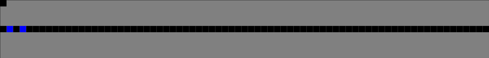
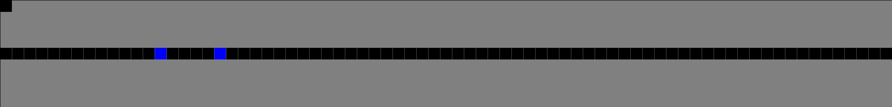
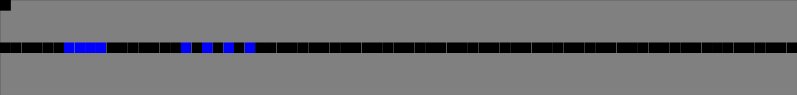

# Postępy prac

## Prace wykonane na rzecz projektu w okresie od ostatniego spotkania
   
Drugie dwa tygodnie pracy:

1. Kontynuacja prac nad modelem formalnym
2. Dalsza analiza materiałów źródłowych pod kątem implementacji
  
## Zestawienie osób i wykonanych przez nie zadań

+---------------------------------------------------+-----------+-----------+-----------+
| Zadanie                                           | Łukasz \  | Dawid \   | Mateusz \ |
|                                                   | Łabuz     | Małecki   | Mazur     |
+:==================================================+:=========:+:=========:+:=========:+
| Kontynuacja prac nad modelem formalnym            |\checkmark |\checkmark |\checkmark |
+---------------------------------------------------+-----------+-----------+-----------+
| Dalsza analiza materiałów źródłowych              |           |           |\checkmark |
| pod kątem implementacji                           |           |           |           |
+---------------------------------------------------+-----------+-----------+-----------+

# Kontynuacja prac nad modelem formalnym

## Przypomnienie celu projektu

Celem projektu jest stworzenie modelu symulacyjnego ruchu drogowego na rondzie Grunwaldzkim w krakowie.

{height=60%}

## Materiały źródłowe

Kwerenda literaturowa naszego projektu została podzielona na dwie sekcje - główną oraz pomocniczą.

Materiały z sekcji głównej będą stanowiły podstawę do stworzenia modelu formalnego,
natomiast materiały z sekcji pomocniczej będą stanowiły dodatkowe źródła informacji,
które mogą okazać się przydatne w trakcie tworzenia modelu formalnego i implementacji.   

### Główne materiały źródłowe

- Gora P. *Adaptacyjne planowanie ruchu drogowego* [@gora2010adaptacyjne]
- Rasouli A. *Pedestrian Simulation: A Review* [@rasouli2021pedestrian]

## Skale oraz technika symulacji

W materiale [@rasouli2021pedestrian] przedstawione zostały definicje różnych skal oraz technik symulacji.

W naszym projekcie wykorzystujemy następujące:

### Techniki symulacji

**Model komórkowy** - model polegający na dyskretyzacji obszarów, na których poruszają się symulowane jednostki. Według założenia, każda z nich może zajmować jedną komórkę na siatce w danym momencie. W każdym kroku symulacji, jednostki mogą zmienić swoją pozycję na sąsiednią komórkę.

---

### Skale symulacji

**Agent-Based** - skala, w której każda jednostka jest rozróżnialna, ma własne, zdefiniowane statystyki oraz zbiór możliwych do podjęcia decyzji. Na jej zachowanie ma wpływ otoczenie, infrastruktura czy też inne jednostki.

**Entity-Based** - skala, w której jednostki są z założenia nierozróżnialne. Nie wyróżniają się niczym. Zachowują się według ściśle ustalonych reguł. Nie mają wpływu na otoczenie. 

## Elementy modelu formalnego

### Automat komórkowy

Rozpoczęcie formalizacji naszego modelu zaczynamy od definicji automatu komórkowego przedstawionej w [@gora2010adaptacyjne] - rysunek \ref{img_gora_2009_def_aut_kom}.

---

![Definicja Automatu komórkowego przedstawiona w [@gora2010adaptacyjne] \label{img_gora_2009_def_aut_kom}](img/gora-2010-definicja-automatu-komorkowego.png)

---

### Jednostki

Następnie rozważamy algorytmy zachowania jednostek, które wchodzą w skład naszego modelu.
W naszym przypadku przedstawiają je następujące rysunki:

- pojazdy - rysunek \ref{img_gora_2009_alg_ruch_poj}
- piesi - rysunek \ref{img_rasouli_2021_alg_ruch_piesz}
- sygnalizacja świetlna - rysunek \ref{img_gora_2009_akg_sygn_sw}.

---

![Algorytm ruchu pojazdów przedstawiony w [@gora2010adaptacyjne] \label{img_gora_2009_alg_ruch_poj}](img/gora-2010-alg-ruch-poj.png)

---

![Algorytm ruchu pieszych przedstawiony w [@rasouli2021pedestrian] \label{img_rasouli_2021_alg_ruch_piesz}](img/rasouli-2021-alg-ruch-piesz.png){height=80%}

---

![Algorytm działania sygnalizacji świetlnej przedstawiony w [@gora2010adaptacyjne] \label{img_gora_2009_akg_sygn_sw}](img/gora-2010-akg-sygn-sw.png)

## Podsumowanie

Praca [@gora2010adaptacyjne], oprócz wyżej wymienionych definicji i algorytmów (Rysunki \ref{img_gora_2009_def_aut_kom}, \ref{img_gora_2009_alg_ruch_poj}, \ref{img_gora_2009_akg_sygn_sw}),
zawiera również szerokie opisy poszczególnych elementów modelu oraz ich zachowań. 

Praca [@rasouli2021pedestrian] zawiera krótki, ale konkretny opis algorytmu ruchu pieszych
oraz ich zachowania.

### Model formalny

Nasz model będzie połączeniem elementów z obu prac. Dzięki obszernym opisom z pracy [@gora2010adaptacyjne] łatwo zrozumieć, jak poszczególne elementy modelu powinny ze sobą współpracować oraz jak, do modelu przedstawionego przez jego autora, dodać symulację pieszych z pracy [@rasouli2021pedestrian]. Stworzenie aplikacji symulacyjnej na podstawie tak przygotowanego modelu nie powinno zatem stanowić problemu.

# Dalsza analiza materiałów źródłowych pod kątem implementacji

## Minione zadanie - Próba implementacji prostego modelu NaSch

Cztery tygodnie temu postanowiliśmy spróbować zaimplementować prosty model NaSch, 
aby lepiej zapoznać się z biblioteką *CellPyLib* oraz problematyką projektu.

---

> Model Nagela-Schreckenberga (w skrócie: model NaSch) służy do symulacji ruchu pojazdów na
> prostym odcinku drogi. [...]

Wyjaśnia autor we wstępie do pracy [@gora2010adaptacyjne].
Rysunek \ref{img_gora_2010_aut_kom_ns} obrazuje model.

![Automat komórkowy w modelu NaSch. Źródło: [@gora2010adaptacyjne] \label{img_gora_2010_aut_kom_ns}](img/gora-2010-aut-kom-ns.png){height=30%}

## Wyniki 

Do tej pory implementowaliśmy modele będące lub bazujące na przykładach dostarczanych przez autorów biblioteki *CellPyLib*.

Próba implementacji modelu NaSch była więc naszą pierwszą próbą stworzenia własnego modelu.
W symulacji brały udział 2 samochody.
Wyniki zadania przedstawiają rysunki \ref{img_nash_0}, \ref{img_nash_1} oraz \ref{img_nash_bad}.

Zaimplementowany model działa w większości przypadków poprawnie, **jednakże niestety czasami zdarzają się błędy**.

---

{width=80%}

{width=80%}

{width=80%}

Na rysunkach \ref{img_nash_0}, \ref{img_nash_1}, \ref{img_nash_bad} 
samochody przedstawione zostały na niebiesko, ulica na czarno, a otoczenie na szaro.

## Wnioski

Wyniki zadania pokazały, że implementacja modelu NaSch nie jest trudna.

Niestety, w naszym przypadku, zaimplementowany model nie działa poprawnie w każdym przypadku.
Wynika to z faktu, biblioteka *CellPyLib* nie nadawała się idealnie do implementacji tego typu modelu. 

Dalsza analiza materiałów źródłowych i znajomość problemów, z którymi zmagaliśmy się podczas implementacji modelu NaSch, utwierdziła nas w przekonaniu, że biblioteka *CellPyLib* 
nie będzie dobrym wyborem do implementacji naszego modelu.

**Rezygnujemy zatem z jej dalszego wykorzystania.**

# Pytania

# Dziękujemy za uwagę

# Bibliografia
