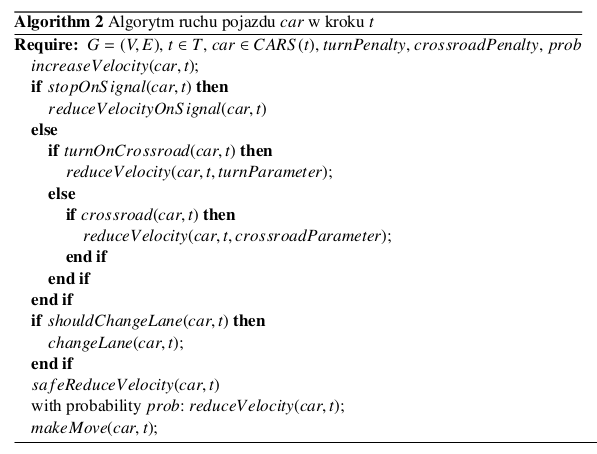

<!-- \newpage -->

# Wstęp

## Cel projektu

Celem projektu jest stworzenie modelu symulacyjnego ruchu drogowego na rondzie Grunwaldzkim w krakowie. Obszar symulacji przedstawia rysunek \ref{fig:obszar_symulacji}.

{width=60%}

## Materiały źródłowe

Materiały [@gora2010adaptacyjne], [@rasouli2021pedestrian] stanowią podstawę, na bazie której stworzony został omawiany model formalny.

# Model formalny

## Model TSF

Współcześnie najskuteczniejsze modele symulacji ruchu drogowego opierają się na teorii automatów komórkowych i modelu Nagela-Schreckenberga ([@nagel1992cellular], [@gora2010adaptacyjne] ).
Model ten służy on do symulacji ruchu pojazdów na prostym odcinku drogi.
Jego istotnym rozszerzeniem tego modelu jest model TSF ([@gora2010adaptacyjne]).
Umożliwia on przeprowadzanie symulacji ruchu na rzeczywistych sieciach drogowych i rzeczywistych danych.
Uwzglednia m.in. takie elementy jak:

- skrzyżowania,
- rozróżnialność kierowców,
- rozróżnialność typów dróg,
- światła drogowe,
- wielopasmowość dróg.

Nasz model bazować będzie na modelu TSF.

### Sieć drogowa w modelu TSF

Sieć drogowa w modelu TSF reprezentowana jest jako graf skierowany $G=(V,E)$, gdzie $V$ to zbiór wierzchołków, a $E\subseteq V \times V$ to zbiór krawędzi. Krawędzie reprezentują odcinki dróg, posiadają określone atrybuty:

- $d$ - długość,
- $lanes$ - liczba pasów ruchu,
- $v_avg$ - średnią maksymalną prędkość jazdy, 
- $v_std$ odchylenie standardowe wartości $v_avg$,
- $type$ - typ drogi.

W obrębie danej krawędzi pasy ruchu są numerowane liczbami naturalnymi. W obrębie pojedynczego pasa, komórki również są numerowane. Komórkę jednoznacznie wyznacza więc trójka: $edge$, $lane$, $cell$. Wszystkie komórki na tej samej krawedzi mają jednakowość długość i wszystkie pasy ruchu na tej krawędzi są podzielone na tyle samo komórek o takiej samej długości.

### Sygnalizacja świetlna

W modelu TSF sygnalizacja świetlna jest zlokalizowana w wierzchołkach grafu. Każdą sygnalizację charakteryzują następujące parametry:

- $id$ - unikalny identyfikator,
- $position$ - lokalizacja (krawędź, na końcu której znajduje się sygnalizacja),
- $t_{green}$ - czas trwania fazy zielonej,
- $t_{red}$ - czas trwania fazy czerwonej,
- $t_{change} - czas trwania zmiany fazy,
- $state$ - aktualny stan ($GREEN$/$RED$).

Wartość $t_{change}$ jest nieujemna i zmniejsza się o 1 w każdym kroku symulacji aż do osiągnięcia wartości 0. Wtedy następuje zmiana stanu sygnalizacji na przeciwny i $t_{change}$ przyjmuje wartość $t_{green}$ lub $t_{red}$ w zależności od stanu, do którego zmieniła sygnalizacja.

Zbiór wszystkich sygnalizacji w modelu oznaczamy jako $SIGNALS$.

### Pojazdy

W modelu TSF pojazdy mają następujące atrybuty:

- $id$ - unikalny identyfikator,
- $edge$ - krawędź, na której znajduje się pojazd,
- $distance$ - odległość od początku krawędzi,
- $id_{lane}$ - pas ruchu, na którym znajduje się pojazd,
- $id_{cell}$ - komórka, w której znajduje się pojazd,
- $profile$ - parametry ruchu pojazdu (wartość z przedziału $[0,1]$),
- $velocity$ - aktualna prędkość pojazdu,
- $path$ - ścieżka, którą pokonuje pojazd,
- $start$ - czas rozpoczęcia symulacji pojazdu.

Zbiór wszystkich pojazdów w modelu oznaczamy jako $CARS$.

### Piesi

Dodani przez nas do modelu piesi mają następujące atrybuty:

- $id$ - unikalny identyfikator,
- $edge$ - krawędź, na której znajduje się pieszy,
- $distance$ - odległość od początku krawędzi,
- $id_{cell}$ - komórka, w której znajduje się pieszy,
- $r_1$ - prawdopodobieństwo, że pieszy przestrzega prawa,
- $r_2$ - prawdopodobieństwo, że pieszy zatrzyma się na czerwonym świetle,
- $t_{walk}$ - czas, przez który pieszy uzna za bezpieczny, aby przejść na drugą stronę ulicy,
- $velocity$ - aktualna prędkość pieszego,
- $path$ - ścieżka, którą pokonuje pieszy,
- $start$ - czas rozpoczęcia symulacji pieszego.

Zbiór wszystkich pieszych w modelu oznaczamy jako $PEDESTRIANS$.

## Automat komórkowy

Automat komórkowy w naszym modelu to krotka:

$$CA=<T,C,N,S,S_0,F>$$

gdzie:

- $T$ - przedział czasu, w którym odbywa się ewolucja automatu,
- $C$ - zbiór komórek,
- $N : C \rightarrow 2^C$ - funkcja, która każdej komórce przyporządkowuje zbiór jej otoczenie, 
- $S$ - zbiór możliwych stanów komórek,
- $S_0 : C \rightarrow S$ - funkcja, która każdej komórce przyporządkowuje jej stan początkowy,
- $F : T \times C \rightarrow S$ - reguła przejścia - funkcja, która każdej komórce przyporządkowuje jej stan po ewolucji.
 
### Zbiór komórek

W naszym modelu komórki są reprezentowane przez pojazdy, pieszych oraz sygnalizacje świetlne. Dla dalszego ułatwienia, zastosujemy oznaczenie $CELLS = CARS \cup PEDESTRIANS$. Wtedy:

$$C = CELLS \cup SIGNALS$$

### Funkcja otoczenia

O ruchu pojazdów oraz pieszych decyduje przede wszystkim ich otoczenia, ale również mogą to być sygnały globalne, pochodzące np. z nawigacji. 

Ponieważ stan sygnalizacji w chwili $t+1$ zależy nie tylko od jej stanu w chwili $t$, ale również od stanu innych sygnalizacji w chwili $t$, ponieważ sygnalizacja może być ustawiane globalnie, w celu optymalizacji ruchu. Zatem:

$$ \forall_{c \in C} N(c) = C \cup SIGNALS$$

### Zbiór stanów

Komórki znajdujące się na krawędziach grafu mogą być zajmowane przez pojazdy, pieszych, lub być puste. Jeżeli w komórce znajduje się pojazd lub pieszy, to jest on jej stanem. Jeżeli komórka jest pusta, to jest stanem jest $null$. W przypadku sygnalizacji, stanem komórki jest fasą sygnalizacji ($GREEN$/$RED$). Zatem:

$$S = \{null\} \cup CARS \cup PEDESTRIANS \cup \{GREEN, RED\}$$

### Funkcja stanu początkowego

Stan początkowy komórki jest zależny od tego, czy jest to sygnalizacja, czy komórka na krawędzi. W przypadku sygnalizacji, stan początkowy jest dowolnym elementem ze zbiołu $\{GREEN, RED\}$. Konfiguracja początkowa komórek ze zbioru CELLS to rozmieszczenie pojazdów i pieszych, którzy rozpoczynają ruch wraz z początkiem symulacji na odpowiednich komórkach CELLS.

### Funkcja przejścia

Funkcja przejścia jest najbardziej złożonym elementem automatu komórkowego.

Dla komórek ze zbioru SIGNALS regułę przejścia definiuje algorytm przedstawiony na rysunku \ref{alg:signals}.

Dla komórek ze zbioru CARS regułę przejścia definiuje algorytm przedstawiony na rysunku \ref{alg:cars}. W tej funkcji wykorzystywane są następujące parametry pomocnicze:

- $turnPenalty \in [0,1]$ - zachowanie pojazdu przed skrętem, 
- $crossroadPenalty \in [0,1]$ - zachowanie pojazdu w trakcie przejazdu przez skrzyżowanie (bez skręcania),
- $prob \in [0,1]$ - losowa redukcja prędkości pojazdu.
  

Dla komórek ze zbioru PEDESTRIANS regułę przejścia definiuje głownie macierz prawdopodobieństw $P$ oraz, w przypadku przechodzenia przez przejście dla pieszych, fragment algorytmu przedstawionego na rysunkach \ref{alg:pedestrians}, \ref{alg:pedestrians_sub}.

$P$ jest macierzą o wymiarach $3 \times 3$, która tworzona jest na bazie najbliższego otoczenia pieszego. Pieszy może zmienić pozycję na jedną z 8 sąsiednich komórek. W zależności od tego, czy pieszy chce skręcić, wyprzedzić innego pieszego, czy dalej kontynuować ruch prosto, prawdopodobieństwo zajęcia danej komórki jest różne.

![Algorytm opisujący część funkcji przejścia dla komórek ze zbioru $PEDESTRIANS$. Źródło: [@rasouli2021pedestrian] \label{alg:pedestrians} ](img/alg_pedestrians_1.png)

![Algorytm opisujący część funkcji przejścia dla komórek ze zbioru $PEDESTRIANS$ - podproces 1. Źródło: [@rasouli2021pedestrian] \label{alg:pedestrians_sub} ](img/alg_pedestrians_2.png){width=80%}

\newpage
\newpage

# Bibliografia
