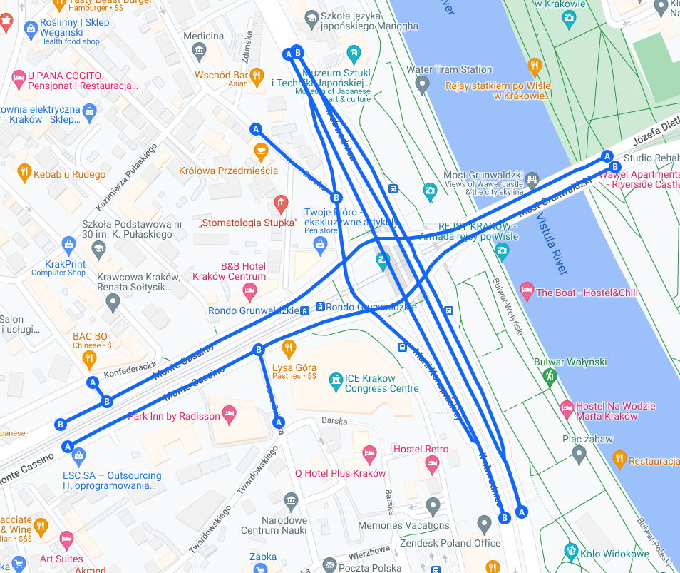

# Postępy prac

## Prace wykonane na rzecz projektu w okresie od ostatniego spotkania
   
1. Stworzenie prototypu symulatora (milestone 03)
2. Rozpoczęcie prac nad wykorzystaniem i analizą danych z symulacji
  
## Zestawienie osób i wykonanych przez nie zadań

+---------------------------------------------------+-----------+-----------+-----------+
| Zadanie                                           | Łukasz \  | Dawid \   | Mateusz \ |
|                                                   | Łabuz     | Małecki   | Mazur     |
+:==================================================+:=========:+:=========:+:=========:+
| Stworzenie prototypu symulatora                   |\checkmark |\checkmark |\checkmark |
+---------------------------------------------------+-----------+-----------+-----------+
| - implementacja ładowania modelu środowiska       |           |           |\checkmark |
+---------------------------------------------------+-----------+-----------+-----------+
| - implementacja ruchu pojazdów                    |           |           |\checkmark |
+---------------------------------------------------+-----------+-----------+-----------+
| - implementacja działania świateł                 |           |\checkmark |           |
+---------------------------------------------------+-----------+-----------+-----------+
| - stworzenie modelu json Gonda Grunwaldzkiego     |\checkmark |           |           |
+---------------------------------------------------+-----------+-----------+-----------+
| Rozpoczęcie prac nad analizą danych               |           |           |\checkmark |
+---------------------------------------------------+-----------+-----------+-----------+

# Przypomnienie celu projektu

Celem projektu jest stworzenie modelu symulacyjnego ruchu drogowego na rondzie Grunwaldzkim w Krakowie.

{height=60%}

# Implementacja symulatora

## Model środowiska

Model środowiska został stworzony w języku Python i wykorzystuje bibliotekę *NetworkX*.

Model środowiska jest grafem skierowanym, w którym wierzchołki reprezentują skrzyżowania, a krawędzie reprezentują drogi.
Każda krawędź składa się z co najmniej jednego pasa ruchu.
Każdy pas ruchu składa się z komórek automatu komórkowego, na których mogą znajdować się pojazdy.

Dane do modelu środowiska są ładowane z pliku w formacie JSON.

Oprócz informacji o grafie dróg, plik JSON zawiera informacje o:

- współrzędnych geograficznych skrzyżowań,
- umiejscowieniu świateł na skrzyżowaniach,
- położeniu generatorów pojazdów oraz dostępnych skrzyżowań docelowych.

---

### GUI symulatora

GUI symulatora zostało stworzone w języku Python i wykorzystuje o bibliotekę *Pygame*.

\
Umożliwia ono wyświetlanie stanu symulatora w czasie rzeczywistym.
Możliwe jest sterowanie symulacją za pomocą klawiatury, 
a także przeglądanie podstawowych statystyk symulacji.
Obecny wygląd GUI symulatora przedstawia rysunek \ref{img_gui_symulatora_1}.

---

). Wierzchołki grafu (skrzyżowania) przedstawione są jako szare punkty. Krawędzie składają się z co najmniej jednej, kropkowanej linii. Linie obrazują pasy ruchu, a kropki komórki automatu. \label{img_gui_symulatora_1}](img/simulator-gui-1.png)

# Pytania

# Dziękujemy za uwagę

[//]: # (# Bibliografia)
